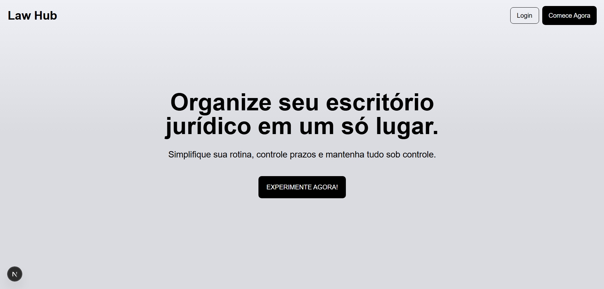

# ⚖️ LawHub — Sistema Jurídico Completo

> Plataforma completa para advogados(a) gerenciarem **clientes, processos, documentos, prazos e finanças** em um painel simples, rápido e moderno.

O **LawHub** é um projeto full stack desenvolvido com **Next.js 15 (App Router)**, criado para ajudar profissionais do direito a centralizarem e organizarem todas as informações essenciais do escritório em um único lugar.

Ele integra **autenticação, dashboard, gestão de processos, clientes, documentos, prazos e finanças**, tudo conectado ao backend usando tecnologias modernas.

---

## 🚀 Tecnologias

* **Next.js 15 (App Router)**
* **TypeScript**
* **MongoDB + Mongoose**
* **NextAuth.js**
* **Tailwind CSS**

---

## ⚙️ O que estou aprendendo e construindo

### 🧠 Backend com Next.js e MongoDB

* **Rotas server-side com App Router**, utilizando padrões modernos do Next.js 15.
* **Modelagem completa e eficiente do banco de dados** com MongoDB e Mongoose (Processos, Clientes, Documentos, Prazos, Finanças).
* **Autenticação JWT/Sessions** usando NextAuth para controle seguro de login e acesso.
* **CRUD completo** para todos os módulos do sistema:

  * Clientes
  * Processos
  * Prazos
  * Documentos (com upload)
  * Finanças
* **Relacionamentos entre coleções**, por exemplo:

  * Processo → Cliente
  * Documento → Cliente/Processo
  * Prazos → Processo
* **Populate automático** para exibir informações completas (ex: nome do cliente no card do processo).

## 🎨 Frontend com Next.js

* **Dashboard moderno e responsivo**, construído com Tailwind.
* **Sistema de navegação interno sem recarregar página**.
* **Formulários controlados** para cadastros e edição.
* **Listagens inteligentes** com:

  * filtro,
  * busca,
  * atualização em tempo real via revalidação.
* **Cards dinâmicos** mostrando informações como:

  * Nome do cliente
  * Número do processo
  * Tribunal
  * Status
* **Controle de sessão no client**, protegendo rotas e garantindo acesso seguro.
* **Upload de documentos** diretamente pelo navegador.

---

## 📲 Funcionalidades (em desenvolvimento)

✔ Autenticação com login seguro
✔ Proteção da rota `/dashboard`
✔ CRUD completo de **clientes**
✔ CRUD de **processos**, com vínculo ao cliente
✔ Exibição automática do **nome do cliente** nos cards
✔ CRUD de **prazos**
✔ CRUD de **finanças** (entradas/saídas)
✔ Upload + gerenciamento de **documentos**
✔ Dashboard com indicadores rápidos (stats)

---

## 📝 Observações

O **LawHub** ainda está em construção, mas já representa um grande passo no meu desenvolvimento como **full stack**.
Trabalhar neste projeto me trouxe domínio prático sobre:

* Autenticação com NextAuth
* Criação de APIs com App Router
* Conexão avançada com MongoDB
* Modelagem real para um sistema complexo
* Regras de Hooks do React
* Upload de arquivos
* UI responsiva e focada em produtividade

## 📨 Contato

📧 **[guilhermemillerblack@gmail.com](mailto:guilhermemillerblack@gmail.com)**
